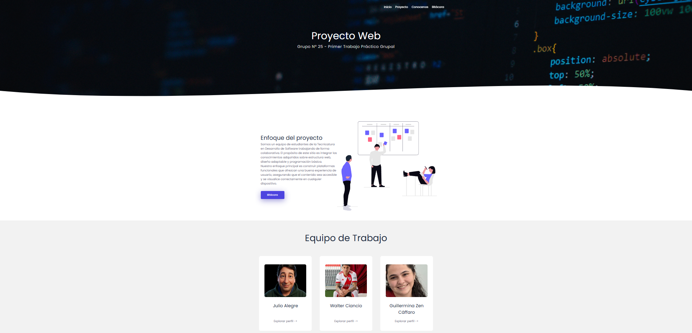
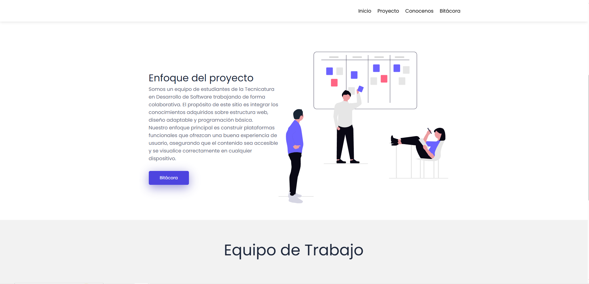
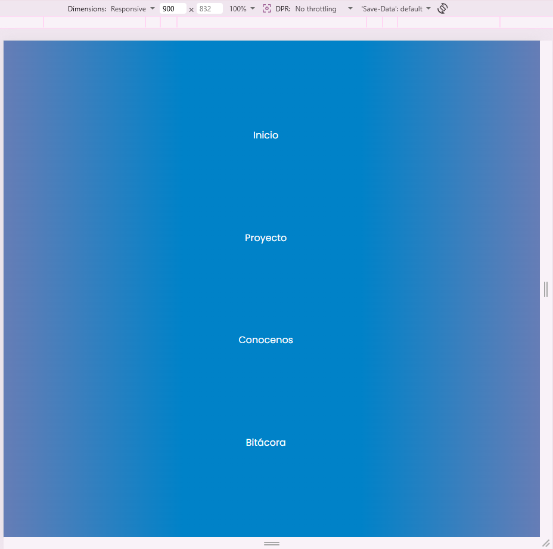
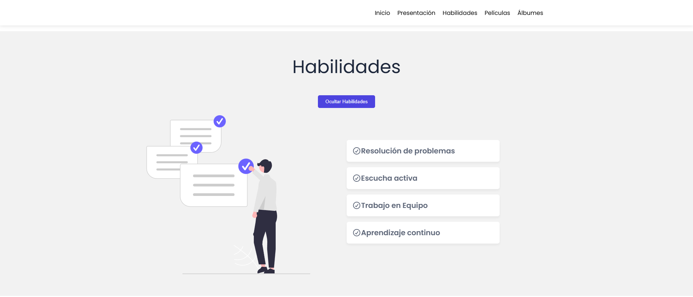

Proyecto Web en Equipo: Grupo N°25
Trabajo Práctico Grupal Nº 1 - IFTS N.°29

Enlace al Proyecto Desplegado: [Sitio en Vercel](https://tp-1-frontend-grupo25.vercel.app/)

Repositorio GitHub: [Código en GitHub](https://github.com/JulioAlegre-dev/TP1-Frontend-Grupo25)

## 📝 Descripción del Proyecto
Este proyecto es un sitio web colaborativo desarrollado como parte del Trabajo Práctico Nº 1. Consiste en una plataforma de presentación grupal que incluye una portada interactiva, una bitácora del proceso de desarrollo y páginas individuales para cada integrante. El objetivo es demostrar habilidades en la estructuración de archivos, diseño responsive (400px, 900px y 1200px), y la implementación de interactividad mediante JavaScript.

👥 Integrantes
* **Julio Alegre** - [Perfil de GitHub](https://github.com/JulioAlegre-dev)

* **Walter Ciancio** - [Perfil de GitHub](https://github.com/walter30ciancio)

* **Guillermina Zen Cáffaro** - [Perfil de GitHub](https://github.com/guillecaffaro)

## 🛠️ Tecnologías Utilizadas
Lenguajes: HTML5, CSS3, JavaScript (Vanilla).

Fuentes: Google Fonts (Poppins).

Iconografía: FontAwesome.

Despliegue: Vercel.

## 📂 Estructura de Archivos
El proyecto sigue una organización modular y jerárquica:

* Raíz (/): Directorio principal que contiene la portada y las páginas individuales.  

    * index.html: Portada principal del sitio.  

    * bitacora.html: Registro del proceso de desarrollo.  

    * guillermina.html: Tarjeta de presentación de Guillermina.  

    * julio.html: Tarjeta de presentación de Julio.  

    * walter.html: Tarjeta de presentación de Walter.  

* README.md: Documentación técnica del proyecto.  

* /css: Contiene style.css con los estilos globales y breakpoints de diseño adaptable (400px, 900px, 1200px).  

* /js: Carpeta con los archivos de interactividad dinámica (main.js y bitacora.js).  

* /img: Directorio central de recursos visuales:  

    * /inicio: Imágenes y recursos del header y portada (ej. work_team.svg).  

    * /conocenos: Avatares y fotos de perfil de los integrantes.  

    * /integrantes: Subcarpetas organizadas por miembro (/julio, /walter, /guillermina) que contienen sus respectivos archivos de /peliculas y /canciones (visualizadas como Álbumes).

    * /capturas: Documentación visual que evidencia la interactividad dinámica, las funciones de JavaScript y el diseño adaptable (responsividad) para la evaluación del proyecto.  

## 🎨 Guía de Estilos

Paleta de Colores:

Fondo: #ffffff / #f2f2f2

Títulos: #1d273b

Acentos y Botones: #4d44df

Tipografías: Se utiliza [Poppins](https://fonts.google.com/specimen/Poppins) para todo el sitio, garantizando legibilidad y estética moderna.

Privacidad: Siguiendo las recomendaciones, el uso de imágenes es mixto. Guillermina utiliza una fotografía real, mientras que otros integrantes optaron por avatares generados por IA para resguardar su privacidad.

## ⚡ JavaScript e Interactividad
El proyecto implementa interactividad personalizada mediante JavaScript Vanilla para mejorar la navegación y la experiencia de usuario:

*   **Navegación Dinámica (Scroll Tracking):**
    *   **Qué hace:** Al detectar un desplazamiento vertical superior a 100px, el script añade la clase `.nav2` al menú y la clase `.negro` a los enlaces. Esto modifica el fondo y el color de la fuente para asegurar que el menú sea legible sobre el contenido de la página.
    *   **Ubicación:** Función principal en `js/main.js`, aplicada de forma global en `index.html` y páginas individuales.

    

*   **Menú Hamburguesa (Responsive):**
    *   **Qué hace:** Gestiona la apertura y cierre del menú lateral en dispositivos móviles mediante un sistema de estado (semáforo). Incluye una función de auto-cierre al hacer clic en cualquier enlace de navegación.
    *   **Ubicación:** Funciones en `js/main.js`, controlando el elemento `.hamburger` en el `index.html`.

    

*   **Animaciones de Entrada (AOS Library):**
    *   **Qué hace:** Se inicializó la librería AOS para generar efectos de fundido y zoom en las tarjetas de integrantes y secciones principales al hacer scroll.
    *   **Ubicación:** Inicialización en `js/main.js` y atributos `data-aos` en el HTML de las secciones correspondientes.

*   **Interacción en Tarjetas Personales (Toggle Skills):**
    *   **Qué hace:** Implementamos una función (`toggleSkills`) que permite mostrar u ocultar de forma dinámica la sección de habilidades técnicas de cada integrante, optimizando el espacio visual y permitiendo una interacción directa del usuario con la tarjeta.
    *   **Ubicación:** Bloque `<script>` interno dentro de `julio.html`, `walter.html` y `guillermina.html`.

    

## 🤖 Uso de Inteligencia Artificial

La integración de IA se realizó bajo un criterio de **asistencia técnica estratégica**, manteniendo siempre la autoría y supervisión humana sobre el resultado final:

*   Herramientas Utilizadas: 

    *   Gemini 1.5 Flash y Claude 3.5 Sonnet.

    *   Generación de Imágenes: Adobe Firefly y Nano Banana 2.

*   Aplicación en Código y Contenido:

    *   Depuración CSS: Asistencia en el debugging para resolver conflictos de jerarquía y asegurar el comportamiento de elementos visuales (ej. object-fit: cover en avatares).

    * Optimización Responsive: Refinamiento de la lógica de Media Queries para asegurar la integridad del diseño en los breakpoints de 400px, 900px y 1200px.

*   Criterio de Prompts para Imágenes:

    *   Objetivo: Generar avatares digitales que resguarden la privacidad de los integrantes.  

    * Prompting: Se utilizaron descripciones orientadas a un estilo minimalista y profesional (ilustración/cartoon), manteniendo coherencia con la paleta de colores del sitio (#1d273b y #4d44df) para lograr una estética visual uniforme en todo el equipo.

## 📓 Bitácora (Resumen)

El desarrollo del proyecto se dividió en hitos clave para asegurar el cumplimiento de todos los requisitos técnicos:

*   Fase de Estructura: Diseñamos una arquitectura modular de carpetas para organizar los recursos de cada integrante de forma independiente y prolija.

*   Decisión de Diseño: Implementamos una identidad visual basada en la tipografía Poppins y unificamos el formato de imagen circular para todos los perfiles, buscando un estilo profesional y coherente.

*   Desarrollo Técnico: Programamos la interactividad mediante **JavaScript Vanilla**, destacando el menú que cambia de color al hacer scroll y el sistema de navegación para móviles.

*   Ajuste de Diseño Adaptable: Optimizamos el sitio para los tres tamaños de pantalla obligatorios (400px, 900px y 1200px), corrigiendo problemas de lectura en dispositivos pequeños.

*   Desafío Detectado: Documentamos una inconsistencia visual en el menú hamburguesa de la página de Bitácora, la cual fue resuelta mediante la unificación de selectores CSS.

Este proyecto fue realizado para la materia **Desarrollo de Sistemas Web Frontend** del **IFTS Nº 29**.
